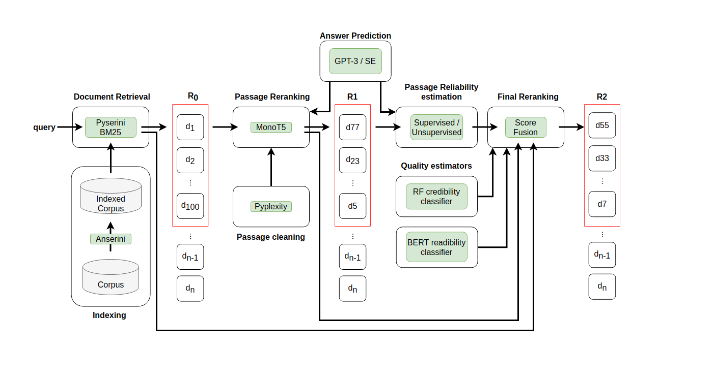
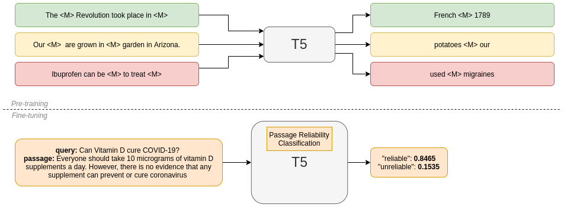
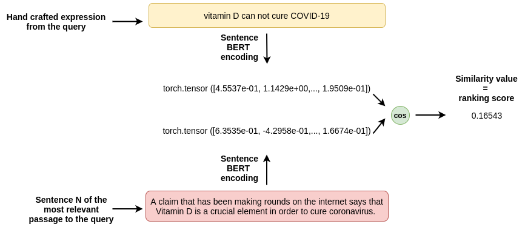

In this repo, we present a multistage retrieval system for health misinformation detection. 

The different stages can be run separately or as inputs to each other. Indexing and document retrieval can be run locally. However, the remaining stages require a GPU for better performance. That's the reason why our Python code scripts are meant to be run in an **environment with GPU**, like a cluster.

However, since this is not always possible, we made our best effort to also adapt the more consuming stages to the **Google Colab** tool.

The full system **architecture** looks like this: 



## Installation 

In order to install all the dependencies necesaries for our multistage retrieval system, you can run: 

*pip install -r requirements.txt*

## Indexation

This phase corresponds to script *indexer/index.sh* and it needs to be executed inside [Anserini's](https://github.com/castorini/anserini) compiled folder (*https://github.com/castorini/anserini*). Check the script comments to see which arguments to launch it with.

## Document retrieval

(**IMPORTANT**: You need to have Java 11 installed for this part)

BM25 initial retrieval performed using [Pyserini](https://github.com/castorini/pyserini) library and standard parameters. To execute this phase, you need to run the scripts under the folder *baseline_retrieval*. This operation does not require GPU by default.

## Passage reranking

Passage reranking stage over the top n=100 documents returned by the previous phase. To that end, we use [Pygaggle](https://github.com/castorini/pygaggle) library, and specifically, T5 base model finetuned with MS MED MARCO for passage relevance task. 

We have made several tests and confirmed that these technology works better under a **modified correct sentence**. However, these is not always possible for all scenarios, because for example in the use case of web search, end-users usually don't know the answer of the query they are looking for (see *Answer Prediction* section, later).

From this point on, we offer the possibility to utilise **Google Colab**. This tool provides access to a GPU environment with the necessary dependencies to work with the neural models we need.

<a href="https://colab.research.google.com/drive/1Ppnd7TMBj8l1mro4XI78nC_PJnBxrV4u"></a>

### Answer Prediction

In TREC Healt Misinfo 2019, 2020 and 2021 editions, organisers always provided the answer to the topics. However, this wasn't very realistic. This could just model the job of a moderator of a website or social media. However, in 2022, they asked to **predict** the answer. This is more realistic and supports better the use case of a end-user trying to search for info online.

To do so, we implemented two strategies: asking a generative model like **GPT-3** and analysing the answer or extracting the knowledge from the search engines, in this case from the top 1 result.

#### Cleaning stages

We are also working in improving the quality of automatically generated passages, with our unsupervised tool [Pyplexity](https://github.com/citiususc/pyplexity).

## Passage reliability estimation

### Supervised

(This notebook was obtained and modified directly from the HuggingFace official [one](https://colab.research.google.com/github/patil-suraj/exploring-T5/blob/master/t5_fine_tuning.ipynb) on how to fine tune a T5 model for classification) 

This notebook gives support for fine tuning a T5-base model to classify passages as *reliable* or *unreliable* to a given query.

<a href="https://colab.research.google.com/drive/1N84trSsBtbkvA7PHS1DF1aDB1w2gheEl"></a>



### Unsupervised

This notebook implements an unsupervised approach for estimating passage reliability based on sentence similarity.

<a href="https://colab.research.google.com/drive/1kzSH_DQQn_gbfIA3ybzynHfgMwT_WC5-"></a>




## Quality estimators

A RF credibility classifier and a BERT-based readibility estimator where trained with CLEF 2018 CHS Task Collection as input data. The main goal was providing more signals to the system that were able to improve the final ranking.

## Score Fusion

Finally, we can reorder the rankings using only **one** signal or feature or **fusing** multiple scores from the ranking generated in the previous stages.

<a href="https://colab.research.google.com/drive/1KoxHh0Q2dNeu9CtX0SL-UqCVpjTl3Z9_"></a>

Under the folder evaluator, a script named **compat_evaluator.py** is also provided. This file is meant to be run in a server with GPU access and it supports evaluating transformer models, classical models, fusing signals, etc.

## Example with TREC 2020 Health Misinfo Track Collection

The following is an indication of how, using this repository, the PAS_REL run detailed in the paper could be reproduced. This is just an example of use to familiarise the end-user with the system:

```
./indexer/index.sh CommonCrawlWarcCollection /home/marcos/trec2020-collection WarcGenerator pas_rel # run this inside anserini compile folder

./baseline\_retrieval/sparse\retrieval/baseline\_retrieval.py 

## From here, the output file is taken and uploaded for use in Google Colab:

## Run unsupervised notebook with pas_rel.txt generated in the previous phase 
## Run score fusion notebook reordering only by score_descr and with the output file from the unsupervised phase
## Results could be evaluated with extended trec eval

```

## Cite this article

To any existing issue, contact me at marcosfernandez.pichel@usc.es.

**Main contribution**:

```
@article{health-misinfo-pipeline,
title = {A multistage retrieval system for health-related misinformation detection},
journal = {Engineering Applications of Artificial Intelligence},
volume = {115},
pages = {105211},
year = {2022},
issn = {0952-1976},
doi = {https://doi.org/10.1016/j.engappai.2022.105211},
url = {https://www.sciencedirect.com/science/article/pii/S0952197622002950},
author = {Marcos Fernández-Pichel and David E. Losada and Juan C. Pichel}
}
```

TREC participations:

```
@inproceedings{citius-trec-2020,
	title = {{CiTIUS} at the {TREC 2020 Health Misinformation Track}},
	booktitle = {The Twenty-Ninth Text REtrieval Conference Proceedings (TREC 2020), NIST Special Publication 1266},
	year = {2020},
	author = {Marcos Fern\'{a}ndez-Pichel and David E. Losada and Juan C. Pichel and David Elsweiler}
}

@inproceedings{citius-trec-2021,
	title = {{CiTIUS} at the {TREC 2021 Health Misinformation Track}},
	booktitle = {The Thirtieth Text REtrieval Conference Proceedings (TREC 2021), NIST Special Publication 500-335},
	year = {2021},
	author = {Marcos Fern\'{a}ndez-Pichel and Manuel Prada-Corral and David E. Losada and Juan C. Pichel and Pablo Gamallo}
}

```

You can also find this project in **Gitlab**: https://gitlab.citius.usc.es/marcos.fernandez.pichel/health-misinformation-detection-pipeline 
